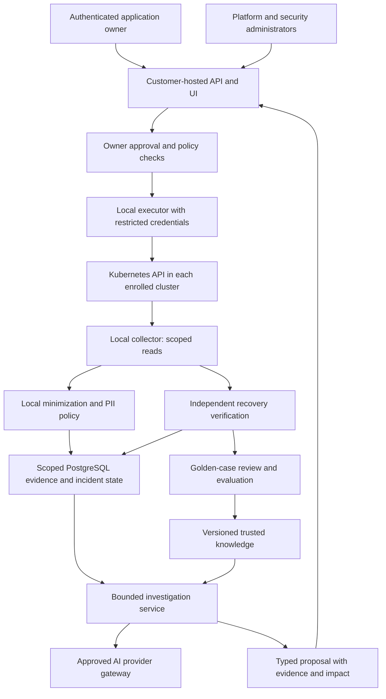

# Enterprise SRE: Evidence, Ownership, and Controlled Recovery

Date: 2026-09-08

Status: Proposed architecture responding to the enterprise requirements of 2026-09-08. This document and its companion program plan are planning deliverables, not a claim that these capabilities are implemented or production-validated.

## Product vision

KubeBee is a customer-hosted SRE investigation and recovery system. It helps application owners understand incidents across their Kubernetes fleet, tests competing explanations against evidence, and carries explicitly approved changes through recovery verification. It improves by curating verified operational knowledge while preserving the customer's control over data, infrastructure, and AI providers.

The product promise is that uncertainty, unavailable dependencies, or missing authorization cannot silently become permission to act. We must demonstrate this with enforceable boundaries and failure testing. No system can guarantee that an authorized change has no unintended consequences; the product must make impact, uncertainty, limits, and recovery status visible.

Success is trustworthy diagnosis and verified recovery with low operator effort. Analyzer count, model confidence, number of automated actions, and volume of generated playbooks are not success measures.

## Requirements and invariants

| ID | Requirement | Enforceable invariant |
|---|---|---|
| R1 | Investigate causes instead of treating symptoms | Observations, hypotheses, mitigations, corroborated causes, and recovery outcomes have separate states and provenance. |
| R2 | Prevent wrong diagnoses contaminating subsequent work | Unverified or invalidated conclusions cannot enter the trusted retrieval corpus; a new run starts from scoped evidence and explicit versioned knowledge. |
| R3 | Route results to application owners | Access and delivery are resolved from verified identity and an administrator-governed ownership registry, never model-selected recipients. |
| R4 | Protect customer PII against operator prompting | Source minimization, field policy, and disclosure enforcement run outside the model before inference and before every output sink. |
| R5 | Require an owner's explicit approval for every customer-resource mutation | Diagnosis has no mutation credentials; the executor accepts only an unexpired approval bound to an exact typed plan, target, scope, and owner policy. |
| R6 | Support different clusters and application setups | Stable cluster identity and versioned environment profiles scope evidence, access, providers, policies, caches, proposals, and knowledge. |
| R7 | Learn from successful golden debugging | Evidence-backed, reviewed cases can become versioned knowledge after evaluation; learning never changes permissions or activates itself. |
| R8 | Show improvement honestly | Diagnosis quality, recovery, mitigation, recurrence, abstention, cost, and latency use explicit denominators, windows, and sample sizes. |
| R9 | Let customers select AI providers | Administrators approve provider profiles; authorized owners select eligible profiles per scope/run, subject to privacy and budget constraints. |
| R10 | Let engineers assess individual evidence and conclusions | Each atomic item has an immutable version and an authorized True/False/Cannot verify assessment, with correction, attribution, conflict handling, and reviewed learning lineage. |

Additional invariants: unknown actions are denied; unavailable approval/policy state blocks new mutations; raw customer content is excluded by default; revoked knowledge is excluded at retrieval time; successful API calls do not by themselves establish recovery or causation.

## Architectural choice

Three approaches were considered:

1. **Customer-hosted control plane with scoped per-cluster agents — recommended.** One installation can initially manage its own cluster, using the same contracts needed for additional clusters. PostgreSQL holds durable scoped state. Collection and execution remain local to each enrolled cluster. The diagnostic process receives sanitized evidence and has no Kubernetes credentials. This adds a small number of deliberate security boundaries, without splitting each domain into a service.
2. **Independent full installation per cluster.** Simpler initial deployment and strong physical separation, but fragmented ownership, configuration, knowledge, and fleet reporting. Support this deployment topology through isolated installations, not as the only product model.
3. **Vendor-hosted fleet SaaS.** Central operations and upgrades are easier for the vendor, but customer data boundaries, outbound connectivity, and dependency concerns conflict with the requested deployment model. This is outside the initial enterprise program.

Keep domain logic modular in Go. Separate processes are justified for credentials and trust boundaries: collector, diagnostic/control plane, and optional executor. Do not introduce a workflow engine or graph database initially. PostgreSQL transactions, a durable outbox, and relational evidence links provide the first implementation.

### Deployment and trust boundaries



Default deployment is observe-only: install no customer-resource mutation roles or executor. The collector cannot read Secrets or use exec, attach, port-forward, or proxy APIs. The control plane and provider workers have no service-account token, kubeconfig, cloud mutation credentials, or access to the executor's credentials. Kubernetes API access for additional evidence passes through a typed collector broker with scope, data-class, rate, and response limits.

An optional executor is a separate workload/service account and an authenticated, narrowly exposed service. It cannot accept raw manifests, arbitrary URLs, commands, or model-supplied credentials. An allowlisted typed action is translated into Kubernetes operations by code.

Agent enrollment binds an authenticated agent to organization and cluster IDs. Use short-lived, rotatable credentials and authenticated encrypted transport; reject a caller-supplied cluster ID that differs from the enrolled identity. Revocation and loss of connectivity prevent new executions. Reconnection cannot silently replay old approvals. The database is authoritative for approvals and execution claims; no offline mutation mode is planned.

Agent bookkeeping such as a leader-election Lease is explicitly separated from customer-resource writes: fixed purpose, dedicated namespace-scoped permissions, and no model-accessible generic write tool. Controller installers, migrations, and agent upgrades are administrator deployment operations, not AI tools.

## Evidence-driven investigation

### State and data contracts

Every resource identity includes organization, cluster, namespace when applicable, API group/kind, name, and UID. Evidence includes source, observation time, collection time, resource version, effective scan coverage, collection error, privacy-policy version, and integrity hash. A resource recreation produces a different identity even when its name is reused.

An incident groups findings through resource ownership, application/dependency relationships, and time. A hypothesis contains supporting evidence IDs, contradicting evidence IDs, missing evidence, a bounded explanation, and a proposed read-only test. Model-written explanations never become observed facts merely by being stored.

Keep two independent state machines:

- Investigation: `OPEN -> INVESTIGATING -> NEEDS_EVIDENCE | CORROBORATED | INCONCLUSIVE`; conclusions may become `INVALIDATED` when new evidence contradicts them. Reopening creates a new run with lineage.
- Recovery: `NONE -> PROPOSED -> AWAITING_OWNER -> APPROVED -> APPLYING -> VERIFYING -> RECOVERED | MITIGATED | FAILED | UNKNOWN`; stale/revoked/expired plans stop before execution. Unsupported operations become `MANUAL_REQUIRED`.

`CORROBORATED` means the published evidence meets the configured diagnostic rubric, not that the AI has proved causality. `RECOVERED` describes measured service recovery; it does not automatically corroborate a cause.

### Investigation loop

1. Collect a fresh, scoped snapshot and preserve failed/absent/forbidden coverage. Fix current history reconciliation before relying on event-driven targeted scans.
2. Build an evidence timeline and dependency context: owning controller, recent deployments/configuration changes, resource constraints, service/network/storage dependencies, and permitted application health signals.
3. Generate competing hypotheses when plausible alternatives exist. Do not force an artificial hypothesis count. Label assumptions and observations separately.
4. Select a discriminating read-only check for the leading explanations, subject to scope, privacy, cost, and a bounded investigation budget.
5. Incorporate the result, look for contradictions, and stop repeating tests that add no new information. On exhaustion or unavailable evidence, return `NEEDS_EVIDENCE` or `INCONCLUSIVE` with useful next steps.
6. Publish a concise causal explanation with evidence citations, alternatives considered, uncertainty, and the distinction between mitigation and correction. Do not store or expose private model reasoning traces.
7. Only then propose an allowed typed recovery action, explicitly identifying whether it treats a symptom or a corroborated cause. Urgent mitigation remains possible with an owner's approval and an honest mitigation label.

Example: repeated application restarts may follow database connection failures caused by a network-policy rollout. Pod errors alone do not justify concluding that restarting the application fixes the cause. Compare onset, policy changes, endpoint health, and authorized connectivity evidence. If the actual cause cannot be tested, say so; do not manufacture certainty.

### Preventing diagnostic contamination

- Fresh run context contains current authorized evidence and reviewed knowledge. Conversation assertions are untrusted annotations unless independently supported.
- Separate raw observations, model hypotheses, owner feedback, and verified knowledge in storage and retrieval filters. User agreement alone is not proof.
- Cache identity includes organization, cluster, application/access scope, evidence digest, environment-profile version, privacy-policy version, provider/model profile, prompt/schema version, and knowledge release. Authorization is checked again on cache hits.
- Incorrect conclusions can be explicitly invalidated. Track lineage to invalidate dependent summaries, cached answers, and learned candidates; exclude them immediately even if background deletion has not finished.
- Never train or retrieve successful cases from provider success, approval, pod deletion, or a single healthy sample alone. Fresh runs may use reviewed counterexamples as constraints, not reuse their rejected conclusions as facts.

## Ownership, access, and notifications

Use OIDC identities and groups. Proposed roles are Organization Administrator, Security Administrator, Platform Operator, Application Owner, Investigator, and Viewer. A notification destination is not an identity or an approval authority.

An administrator-governed registry maps stable application IDs to approved cluster/resource selectors, owner groups, designated approvers, dependencies, escalation routes, and privacy/provider policies. Resource labels can suggest mappings but cannot grant ownership. Namespace defaults are useful fallbacks; ambiguous mappings block mutation and enter a platform triage queue. Every ownership/configuration change is versioned and audited.

Owners receive their applications' scoped findings and incident links. A shared infrastructure incident routes to its platform owner; affected application owners receive only authorized impact summaries. Shared-resource changes require the authoritative resource owner's approval and additional affected-owner approvals where policy requires them. Operators cannot assign ownership to themselves to approve a change.

Notifications use a durable outbox keyed by incident state transition and recipient policy, with bounded retries, deduplication, acknowledgement, escalation, and recovery messages. Repeated unchanged scans do not resend "created" notifications. Resolve authorization and privacy again at delivery time so queued notifications cannot bypass revoked access. Models do not choose arbitrary webhook URLs or recipients.

Expose an auditable delegation mechanism for on-call approvers. No response is not approval. Email/chat delivery acknowledgement is not execution approval. Approval uses an authenticated app flow or a separately authenticated integration bound to the immutable plan.

## Privacy that prompting cannot disable

Current credential redaction is a foundation, not comprehensive PII protection. Customer text can appear in logs, events, annotations, object names, traces, runbooks, support bundles, chat messages, tool results, and provider errors.

Proposed enterprise profiles:

| Profile | Collection and inference behavior |
|---|---|
| `STRICT_METADATA` — default | Collect allowlisted structural fields and aggregates. Exclude customer payloads, arbitrary log bodies, and free-text fields unless a reviewed source projection permits them. |
| `SANITIZED_DIAGNOSTICS` | Add explicitly approved sources and structured field mappings, bounded PII detection, and pseudonymized correlation identifiers. Block uncertain or unsupported content. |
| `LOCAL_RESTRICTED` | Apply the same data minimization while restricting inference to an approved customer-local provider and disallowing external fallback. |

Security administrators govern the organization floor. Application policy may tighten it; operators and prompts cannot weaken it. Changes to disclosure/provider policy require an audited administrative path and apply to future access as well as new collection. No enterprise "print raw data" tool or conversational bypass exists.

Minimize and sanitize inside the cluster before central storage or inference. Prefer structured allowlisted projections; regex/PII classifiers alone cannot guarantee that arbitrary free text is safe. Reject unsupported binary/encoded payloads and bound any explicitly supported decoding. Sensitive values never enter the model simply because an operator requested them.

When correlation is needed, use incident/application-scoped keyed pseudonyms. The key and any raw mapping are unavailable to the model; plain hashes of guessable identifiers are insufficient. Apply policy to user prompts, inputs, tool responses, imports, outputs, notification destinations, cache, audit, support bundles, traces, and exports. Do not stream unvalidated model output directly to a client. Block uncertain disclosure rather than emitting a partial raw answer.

Default to no raw-data persistence. Configured retention and erasure cover evidence, caches, conversations, derived summaries, exports, and knowledge lineage; backup expiry and external notification limitations must be documented. No cross-customer knowledge sharing by default. Administrators define permitted provider regions, retention/training terms, egress destinations, and credential references.

Privacy tests include adversarial requests to reveal, translate, encode, reconstruct, or export planted customer identifiers. Passing such tests measures the boundary; it is not a universal guarantee of perfect PII detection.

## Mutation guardrails

RBAC limits what credentials can do; it does not express application ownership, plan approval, exact patch intent, or recovery safety. Combine Kubernetes RBAC with application authorization, typed operation policy, isolated credentials, and executor-side approval validation.

### Complete operation inventory

| Class | Examples | Initial enterprise treatment |
|---|---|---|
| Evidence reads | Scoped get/list/watch, approved log projections | Collector broker only; privacy and access checks still required. |
| Customer-resource writes | create/update/patch/delete/deletecollection, apply, scale, eviction, rollout, cordon | Deny by default; explicitly supported typed action plus owner approval. Bulk deletion and wildcard targets are not supported. |
| Remote execution/tunnels | exec, attach, port-forward, proxy, ephemeral containers | Denied; no general diagnostic escape hatch. |
| Privilege/security changes | RBAC, impersonate, bind, escalate, Secrets, service-account tokens, CSR approval, admission changes | Not executable by the AI product in the initial enterprise release. |
| Indirect writes | CRDs whose controllers mutate infrastructure, Jobs, GitOps commits/PRs/merges, external cloud APIs | Classified by effect; unsupported adapters denied. A PR creates external state and requires scoped approval too. |
| Product administration | Ownership, policy, provider settings, webhook destinations, knowledge promotion | Separate administrative permissions and audit; unavailable as generic AI tools. |
| Product bookkeeping | Approved Lease updates, scoped internal incident records | Fixed internal capabilities, separated from customer mutation credentials and AI tool selection. |

A plan contains exact cluster/resource identities, typed action/parameters, before-state and proposed diff, evidence references, impact assessment, expected service postconditions, timeout, and recovery procedure. Unknown action effects or insufficient impact information block automatic execution. Evidence quality scores do not override authorization.

Approval records include the plan hash/version, organization/cluster/application scope, approver identity and role, ownership-policy version, target UID/resourceVersion, expiry, and required co-approvals. Any material change requires renewed approval. Reject expired, replayed, revoked, cross-cluster, or edited approvals.

Immediately before execution, revalidate identity, current ownership/permissions, current policy, target state, maintenance window, resource limits, and required health/disruption checks. Perform server-side dry-run when supported; a successful dry-run is not a recovery proof or an approval. Live-pod restart uses disruption-aware policy and eviction where appropriate, not blind direct deletion. Protect storage, shared infrastructure, and control-plane targets through explicit denials.

Claim each action transactionally. An idempotency key prevents duplicate scheduling; it cannot guarantee exactly-once external Kubernetes effects. After a crash or ambiguous API response, reconcile observed state instead of blindly retrying. Persist and alert on terminal-write failures. A global/per-cluster/per-application stop control blocks new actions; an already-submitted API request may finish and must be reconciled.

If durable policy/approval state is unavailable, do not submit a new mutation, even with an older in-memory approval. Observe-only collection may continue within bounded local buffers; never silently fall back to an executable file store.

Rollback is itself a mutation. It must be an exact owner-approved contingency included in the original plan and still pass fresh policy/target checks, or obtain a new approval. No automatic broad rollback or emergency bypass. Emergency manual administration remains an external customer procedure and is recorded as an intervention when outcomes are evaluated.

## Cluster and application onboarding

Each enrolled cluster has an immutable ID, verified agent identity, friendly name, environment, region, Kubernetes/distribution capabilities, network/storage/GitOps characteristics, access restrictions, and configuration version. Display names and kubeconfig context names are not security identifiers.

A setup workflow combines read-only discovery with administrator-provided structured configuration and an optional narrative description. Narrative context can describe architecture but cannot change permissions or become verified evidence. Unknown capabilities remain unknown; absent integrations do not mean healthy dependencies.

Application setup records resource ownership, service/dependency relationships, authoritative health signals and SLOs where available, deployment source, known maintenance, allowed provider profiles, data classes, approved notifications, and recovery constraints. Validate configuration against discovered resources and require review of conflicts.

Example configuration shape (proposed, not a currently supported file):

```yaml
schema_version: enterprise-context/v1
cluster_id: cluster-prod-eu-01
environment: production
context_version: 3
application_id: payments-api
scope:
  namespaces: [payments]
  workload_selector: app.kubernetes.io/name=payments-api
owner_group: payments-oncall
approval_group: payments-approvers
privacy_profile: STRICT_METADATA
provider_profile: customer-local-primary
execution_mode: observe-only
dependencies:
  - application_id: payments-db
    relationship: database
health_profile: payments-api-health-v1
```

The UI always shows cluster/environment and scope. Cross-cluster queries require explicit authorization and scope selection. Re-enrollment or profile/ownership changes invalidate affected queued approvals and re-evaluate retrieval eligibility. Legacy records without a verified cluster mapping are quarantined as historical, never silently assigned executable scope.

## AI provider governance

Reuse existing provider adapters behind a shared structured investigation interface. An approved profile defines provider/model, endpoint/region, secret reference, capability/schema support, allowed data classes, time/token/cost budgets, and permitted fallbacks. Authorized users choose among eligible profiles; arbitrary endpoints or provider credentials cannot be supplied through chat.

Snapshot the selected profile/version in each run. A fallback must satisfy the same or stricter privacy/scope constraints, be recorded explicitly, and never turn a local-only request into remote inference. Provider errors, malformed output, unsupported structured tasks, and budget exhaustion produce visible incomplete states rather than fabricated success.

The existing process harness runs a configured executable. It must be disabled in the enterprise diagnostic process until isolated workers enforce an allowlisted executable, explicit environment, resource limits, no inherited kubeconfig/service-account/cloud credentials, no host filesystem/socket access, and governed egress. Bounded stdout and a system prompt are not process isolation.

Provider agreement is not independent evidence. An optional second-model critique can improve evaluation but cannot substitute for real observations or owner approval.

## Verified recovery, golden cases, and learning

Verification requires both action postconditions and the predeclared application health criteria over a configured observation window. A deleted pod or changed replica count proves an operation, not service recovery. Examples include replacement readiness, sustained error-rate recovery, dependency health, and no immediate recurrence. Without permitted health evidence, report `UNKNOWN` or `MITIGATED`, not verified root-cause resolution.

A golden case records sanitized evidence lineage, tested alternatives, corroborated cause or explicitly labeled mitigation, environment applicability, typed actions, owner approval, health checks, observation window, recurrence assessment, interventions, and reviewer identity. Corroborated diagnostic cases that required no mutation can also qualify through an independent evidence review. Failed and ambiguous cases remain available for evaluation and reviewed counterexamples, not positive training examples.

Learning lifecycle: `CANDIDATE -> REVIEW -> EVALUATION -> APPROVED_RELEASE -> RETIRED | REVOKED`. Candidate generation is opt-in initially. Every promoted artifact, including read-only guidance, requires human review in the first enterprise release. Learning updates versioned playbooks, matching rules, or prompts; it cannot change RBAC, privacy, ownership, tool capabilities, approval policy, provider permissions, or its own evaluation rules.

Evaluate candidates against a frozen held-out incident suite, including negative and adversarial cases. Split by incident family/time/source to reduce near-duplicate leakage. Version datasets, rubric, model profiles, and knowledge releases. Compare in shadow read-only mode before rollout; preserve rollback to the previous knowledge release. Invalidation revokes affected descendants and retrieval eligibility immediately.

No online weight training or fleet-wide autonomous policy adaptation is included. Cross-organization sharing requires an explicit future design and privacy review; the initial corpus stays within the customer's authorized scopes.

## Honest quality metrics

Record outcomes per incident as well as per run; retries and provider changes must not manufacture additional successful incidents. Store cohort definitions and verifier/rubric versions. Show counts and uncertainty intervals with rates, and "insufficient data" when samples are inadequate.

An eligible incident is a deduplicated incident accepted for investigation within the predeclared supported application/category cohort. Freeze that cohort definition before computing a comparison. Provider failures, privacy-limited investigations, missing evidence, and abstentions stay in the eligible denominator; display out-of-scope/suppressed observations separately with reasons. Do not retrospectively exclude hard incidents to improve reported yield.

| Metric | Definition |
|---|---|
| Diagnostic coverage | Eligible incidents with an assessed diagnosis / all eligible incidents in the reporting cohort. Pending, failed, and abstained cases remain visible. |
| Assessed diagnostic correctness | Independently corroborated diagnoses / independently assessed diagnoses. Publish assessment coverage; unassessed diagnoses are not counted correct. |
| Verified diagnostic yield | Eligible incidents with a corroborated diagnosis / all eligible incidents, reported by age cohort so recent open cases are visible. |
| Verified recovery rate | Executed recovery attempts meeting predeclared sustained health criteria / executed attempts whose verification window elapsed. Pending windows are shown separately. |
| Mitigation and recurrence | Mitigated incidents separately from corrected causes; recurrences / recoveries with a complete follow-up window. |
| Incorrect-conclusion rate | Assessed conclusions rejected or later invalidated / assessed conclusions, with revisions reflected in historical cohort reporting. |
| Abstention/escalation | Inconclusive or human-escalated runs / completed investigation runs, broken down by missing evidence, privacy, provider, and budget. |
| Safety and privacy | Executed actions without valid approval, cross-scope disclosures, and measured canary leakage must be zero in acceptance tests. Blocked attempts are reported separately, not treated as harmful executions. |
| Efficiency | Time to corroborated diagnosis/recovery, operator effort, provider latency/tokens, and measured or explicitly estimated cost per incident. |

For improvement over time, show paired results on the same held-out dataset as well as stratified production trends by incident category/environment and provider/knowledge version. A changing case mix or small sample must not be presented as proof of improvement. Owner satisfaction is valuable feedback, not a correctness label. Detailed dimensions belong in authorized analytics; keep Prometheus labels bounded and exclude PII and incident IDs.

## Engineer feedback as a first-class workflow

Each incident presents separately reviewable evidence observations and atomic conclusions. Split a sentence that asserts several independently testable claims into individual items. Each item shows its source/time/scope, version, and dependencies so an engineer can see what they are assessing. Evidence assessments concern the observation's accuracy or relevance at the stated time; conclusion assessments concern its interpretation. A log containing a claim is evidence that the text occurred, not proof the claim is true.

Every item offers **True**, **False**, and **Cannot verify**. An optional reason picker includes wrong interpretation, wrong scope, stale evidence, incomplete evidence, and resolved by external change. Allow a short correction, an authorized evidence reference, or a request to collect fresh evidence. Keep the first click lightweight; request additional detail when needed to promote a correction, not before accepting negative feedback. Provide keyboard access, clear saved/error states, and revision history. Bulk review may submit individually identified/versioned items but must not default all unreviewed items to True.

A feedback event contains organization/cluster/application scope, incident/run ID, item ID/version/hash, assessment, reason, sanitized correction, supporting evidence references, reviewer identity and role, timestamp, idempotency key, and an optional superseded-event reference. Authorization is checked when reading the item, writing feedback, resolving evidence references, and retrieving feedback for future runs. Authors may revise through a new event; original observations and prior assessments are immutable. Reject stale item versions with a refresh response rather than attaching feedback to a different conclusion.

Authorized **False** feedback immediately marks the item disputed, quarantines an affected conclusion from trusted reuse, invalidates derived diagnostic caches, and blocks new execution based on that conclusion while review is pending. If a mutation has already been submitted, do not pretend it was canceled: stop subsequent steps and reconcile it. A steward can confirm the invalidation or resolve the dispute with evidence. Re-run diagnosis from remaining facts and the attributed correction when the user requests it; feedback is not permission to perform new writes.

**True** is an engineer assessment, not automatic promotion to verified fact. Keep reviewer confirmation, instrumented observation, adjudicated correctness, and service-recovery verification as distinct labels. Conflicting assessments create a review task for the application's designated diagnostic steward, with escalation to the platform steward for shared infrastructure. Do not silently use last-writer-wins or majority vote. Unknown ownership, unavailable evidence, or unresolved conflict prevents golden-case promotion.

Confirmed corrections create candidate knowledge and regression cases with lineage to the original false claim, corrected explanation, evidence, reviewer, and environment. Review and evaluation are required before release. Uncorroborated False feedback can still safely reduce trust without teaching its replacement as truth. Feedback on obsolete profile/knowledge versions remains historical and does not silently relabel a new run.

Metrics include item review coverage, True/False/Cannot verify counts, dispute resolution latency, adjudicated error rate by evidence versus conclusion, repeat-error rate after a knowledge release, and feedback-driven regression results. Display denominators and unreviewed counts. Review participation and True-click rates are not reported as diagnostic accuracy. Keep evaluation labels in an access-controlled held-out set; learned cases and near-duplicates cannot leak into that set.

## Product experience

Navigation centers on Fleet, My Applications, Incidents, Approvals, Knowledge, Quality, and Administration. Each incident exposes a timeline, evidence freshness and coverage, tested alternatives, impact, owner, proposed action diff, approvals, execution, verification, and correction/invalidation controls.

Operators can assess each evidence item and conclusion with True/False/Cannot verify, explicitly say "this hypothesis is wrong", request a fresh investigation, or report an external manual fix. The UI explains what evidence will be collected and which approved provider will process it. It distinguishes unobserved from healthy and mitigation from root-cause correction. Setup explains missing permissions and integrations without asking for cluster-admin as a shortcut.

## Relationship to existing work

The 2026-09-07 PostgreSQL/playbook design remains valuable input. This proposed direction changes the implementation order and strengthens several assumptions:

| Earlier assumption | Enterprise direction |
|---|---|
| Playbook catalog added alongside existing proposal storage | Shared scoped incident/approval/execution persistence is a prerequisite to enterprise mutation and learning. |
| One finding resolves directly into a diagnosis/proposal | An incident investigation tests hypotheses and records uncertainty before proposing a recovery action. |
| Deleted target, changed revision, or replica value establishes verification | Separate operation completion, sustained application recovery, and diagnostic correctness. |
| Optional automatic activation of observe-only candidates | Human-reviewed release for all learned knowledge in the first enterprise version. |
| Already-approved work may continue from durable local state during database outage | No new mutations without available authoritative policy, approval, and execution-claim state. |
| Configured subprocess harness reused directly | Disable until isolated from cluster credentials, host resources, and uncontrolled egress. |
| Kind and database integration testing deferred in the initial unit | Allowed during development, but real database and disposable-cluster acceptance are mandatory enterprise release gates. |

Do not execute the older playbook plan unchanged for this enterprise program. The companion roadmap decomposes the new requirements into independently reviewable workstreams. Existing unrelated worktree changes are outside this planning change.

## Primary references

Kubernetes documents privilege escalation through workload creation, RBAC binding, impersonation, and related permissions; this motivates the operation inventory and isolated credentials. [RBAC good practices](https://kubernetes.io/docs/concepts/security/rbac-good-practices/)

Kubernetes dry-run provides API validation without persistence; it does not establish future application recovery. [API concepts](https://kubernetes.io/docs/reference/using-api/api-concepts)

OWASP recommends constraining tools, permissions, and autonomy rather than relying solely on model instructions. [Excessive agency](https://genai.owasp.org/llmrisk/llm062025-excessive-agency/)

Sensitive authorization and disclosure controls must remain outside the model and its prompt. [System prompt leakage](https://genai.owasp.org/llmrisk/llm072025-system-prompt-leakage/)

## Comprehensive review amendments (2026-09-08)

The user authorized implementation after comprehensive review. The following contracts resolve the independent review findings and take precedence over broader descriptions above.

1. **Restore authority:** Restored installations start in recovery lockout. New mutation submission and agent/provider authorization are disabled until an administrator establishes a fresh installation authority epoch, revokes old credentials and approvals, restores current policy, and reconciles active attempts with cluster observations. An epoch is not recovered from the restored database alone: bootstrap requires a fresh administrator-controlled deployment secret/authority generation. Pre-restore approvals are never executable in the new epoch. A backup taken before consumption/revocation must not permit replay after restore.
2. **Agent roles:** Collector, executor, and control-plane identities have distinct roles, audiences, capabilities, organization/cluster binding, authority epoch, and enrollment generation. Bootstrap is single-use and administrator-authorized; rotate/re-enroll revokes the old generation. Collectors may publish projected evidence, never claim actions or publish execution receipts. Executors may claim approved actions and publish receipts, never impersonate collector observations. Control-plane requests to collectors require a scoped read capability.
3. **Authoritative invalidation:** Feedback and item dispute state commit in one transaction. Retrieval and action-submission authorization check current eligibility of all ancestors or a synchronously maintained lineage generation. Outbox events update projections and clean caches; they are not the safety barrier. A per-incident/plan serialization boundary orders committed disputes and submission claims: a dispute committed before the authorized submission boundary blocks it. After that boundary the action is in-flight and may occur; feedback stops subsequent actions and triggers reconciliation, without claiming impossible atomicity between PostgreSQL and Kubernetes.
4. **Diagnostic rubric before G1:** W5 delivers a versioned correctness rubric, frozen positive/negative baseline, and independent assessment rules. AI self-confidence and valid citations cannot grant CORROBORATED. A designated authorized diagnostic steward or a preapproved deterministic validator may make that transition only with current relevant evidence, tested discriminating alternatives where applicable, and no unresolved material contradiction. Record the assessor/rubric/version. Missing evidence or an unresolved alternative yields inconclusive/needs-evidence. W9 extends, rather than introduces, this evaluation foundation.
5. **Private exact identity:** Keep raw Kubernetes names/namespace identifiers in an encrypted local collector/executor identity registry when privacy policy excludes them centrally. Central evidence uses opaque resource handles bound to organization, cluster, enrollment/authority generation, UID, and a local exact-target commitment. The local resolver supplies typed execution identity only to the executor; models and generic central APIs cannot reverse handles. An authorized approval display can request a policy-approved local projection; a masked target is clearly marked and does not expose its raw identity to AI. Approval hashes bind the stable exact-target commitment and action parameters. Local mapping retention/key rotation preserve necessary reconciliation and revoke affected approvals when mapping continuity cannot be established. Cross-application correlation uses authorized stable handles, not a global customer identifier.
6. **First-release action scope:** One customer-resource mutation per approval. Multi-step DAGs and automatically executed rollback are outside the first executor release. A proposed rollback is a new exact-target plan requiring fresh approval. This avoids pretending future resourceVersions are known before the first mutation. Later DAG support requires its own reviewed predecessor-receipt and admissible-state contract.
7. **Feedback semantics:** Preserve True/False/Cannot verify UI. Adjudication distinguishes FACTUAL_ERROR, NOT_APPLICABLE, STALE, CONFIRMED, and UNRESOLVED. A False assessment may immediately quarantine a recommendation, but only adjudicated FACTUAL_ERROR changes historical diagnostic correctness. External repair and freshness expiry do not turn a formerly correct observation into a false fact. Learned corrections and regression labels retain this distinction.
8. **Existing-code reuse:** Integrate reusable provider/canonicalization history before new overlapping changes, but retain legacy surfaces as explicitly non-enterprise until adapted. Enterprise mode denies legacy mutation, unscoped catalog promotion/learning, and subprocess harness access. Existing VERIFIED operation-effect checks become APPLIED evidence, never independent recovery. Core organization/cluster-scoped repositories are the authority; the old playbook_catalog tables remain legacy import sources, not parallel executable authority.
